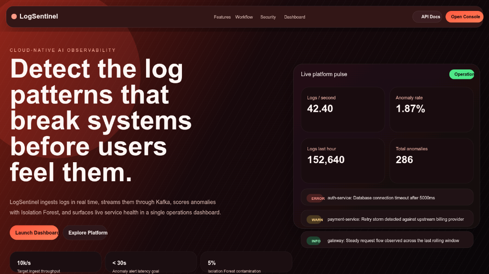

# LogSentinel — Cloud-Native AI Log Monitoring & Anomaly Detection Platform:


---

> **Live Demo →** [logsentinel-log.vercel.app](https://logsentinel-log.vercel.app) &nbsp;
---

## Overview

**LogSentinel** is a production-grade, cloud-native platform that ingests system logs from applications, processes them in real-time through a streaming pipeline, detects anomalies using machine learning, and visualizes system health through live monitoring dashboards 

Everything runs in Docker containers orchestrated by Kubernetes on AWS infrastructure, with a full DevOps CI/CD pipeline powered by Jenkins.

---

## Frontend Preview



---

## Architecture

```
┌─────────────────────────────────────────────────────────────────────────┐
│                         LogSentinel Platform                            │
│                                                                         │
│  ┌──────────┐    ┌────────────────┐    ┌──────────────────────────┐    │
│  │  Apps /  │───▶│  Log Ingestion │───▶│    Apache Kafka          │    │
│  │  Agents  │    │  API (FastAPI) │    │  topic: raw-logs         │    │
│  └──────────┘    └────────────────┘    └──────────────────────────┘    │
│                         │                          │                    │
│                  Prometheus /metrics        ┌──────▼──────┐            │
│                                             │Log Processor│            │
│                                             │(Kafka Cons.)│            │
│                                             └──────┬──────┘            │
│                                                    │                   │
│                          ┌─────────────────────────┤                   │
│                          │                         │                   │
│                   ┌──────▼──────┐        ┌─────────▼────────┐         │
│                   │Elasticsearch│        │  processed-logs   │         │
│                   │  (Storage)  │        │  (Kafka topic)    │         │
│                   └─────────────┘        └─────────┬─────────┘         │
│                          │                         │                   │
│                   ┌──────▼──────┐        ┌─────────▼────────┐         │
│                   │  Dashboard  │        │    ML Engine      │         │
│                   │  Backend    │        │ (Isolation Forest)│         │
│                   └─────────────┘        └─────────┬─────────┘         │
│                          │                         │                   │
│                   ┌──────▼──────┐        ┌─────────▼────────┐         │
│                   │   Grafana   │        │  anomaly-alerts   │         │
│                   │ Dashboards  │        │  (Kafka topic)    │         │
│                   └─────────────┘        └─────────┬─────────┘         │
│                                                    │                   │
│                                          ┌─────────▼────────┐         │
│                                          │  Alert Service    │         │
│                                          │ Redis│PostgreSQL  │         │
│                                          │ Slack│Email       │         │
│                                          └──────────────────┘          │
└─────────────────────────────────────────────────────────────────────────┘
```

---

## Microservices

| Service | Port | Description |
|---|---|---|
| `log-ingestion-api` | 8000 | FastAPI — receives logs, publishes to Kafka |
| `log-processor` | — | Kafka consumer — cleans, structures, indexes logs |
| `ml-engine` | 8001 | FastAPI — Isolation Forest inference + Kafka consumer |
| `alert-service` | — | Kafka consumer — deduplicates + routes alerts |
| `dashboard-backend` | 8002 | FastAPI — query API for Grafana & frontend |

---

## Project Structure

```
logsentinel/
├── services/
│   ├── log-collector/        # Fluentd config or custom collector
│   ├── log-ingestion-api/    # FastAPI app — receives logs
│   ├── log-processor/        # Kafka consumer, cleans logs
│   ├── ml-engine/            # Isolation Forest model + inference API
│   ├── alert-service/        # Sends alerts via email/Slack
│   └── dashboard-backend/    # API for Grafana / frontend
├── infra/
│   ├── terraform/            # AWS infrastructure as code
│   ├── kubernetes/           # All K8s YAML manifests
│   │   ├── deployments/
│   │   ├── services/
│   │   ├── configmaps/
│   │   ├── secrets/
│   │   └── hpa/
│   ├── helm/                 # Helm chart for full deployment
│   └── jenkins/              # Jenkins Dockerfile and config
├── pipeline/
│   ├── kafka/                # Kafka + Zookeeper docker-compose
│   └── fluentd/              # Fluentd config files
├── ml/
│   ├── notebooks/            # Jupyter notebooks for experiments
│   ├── models/               # Saved model files (.joblib)
│   ├── train.py              # Model training script
│   └── evaluate.py           # Model evaluation script
├── monitoring/
│   ├── prometheus/           # prometheus.yml config
│   └── grafana/              # Dashboard JSON exports
├── tests/
│   ├── unit/
│   ├── integration/
│   └── load/
├── Jenkinsfile               # Jenkins CI/CD pipeline
├── docker-compose.yml        # Full local dev environment
├── docker-compose.jenkins.yml # Jenkins server setup
├── docker-compose.prod.yml   # Production compose
├── Makefile                  # Shortcuts: make build, make test, make deploy
├── requirements.txt
└── README.md
```

---

## Quick Start (Local Development)

### Prerequisites

- Docker 24+ & Docker Compose v2
- Python 3.11+
- Make

### 1. Clone the repository

```bash
git clone https://github.com/Arnazz10/logsentinel.git
cd logsentinel
```

### 2. Copy environment variables

```bash
cp .env.example .env
# Edit .env with your Slack webhook, SMTP credentials, etc.
```

### 3. Start all services:

```bash
make up
```

This starts:
- Zookeeper + Kafka
- Elasticsearch + Redis + PostgreSQL
- All 5 microservices
- Prometheus + Grafana + Alertmanager

### 4. Verify services are healthy:

```bash
make health
```

### 5. Send a test log

```bash
curl -X POST http://localhost:8000/ingest \
  -H "Content-Type: application/json" \
  -d '{
    "service": "auth-service",
    "level": "ERROR",
    "message": "Database connection timeout after 5000ms",
    "response_time_ms": 5000,
    "error_code": 500
  }'
```

### 6. Open dashboards

| Tool | URL | Credentials |
|---|---|---|
| Grafana | http://localhost:3000 | admin / admin |
| Prometheus | http://localhost:9090 | — |
| Kibana | http://localhost:5601 | — |
| Log Ingestion API Docs | http://localhost:8000/docs | — |
| ML Engine API Docs | http://localhost:8001/docs | — |
| Dashboard Backend Docs | http://localhost:8002/docs | — |

---

## Machine Learning

### Algorithm: Isolation Forest

| Parameter | Value |
|---|---|
| Algorithm | Isolation Forest |
| Contamination | 5% (0.05) |
| Features | 6 engineered features |
| Output | -1 (anomaly) / 1 (normal) |
| Serialization | Joblib |

### Features

| Feature | Type | Description |
|---|---|---|
| `hour_of_day` | int | Hour extracted from timestamp (0–23) |
| `response_time_ms` | float | Request/operation response time |
| `error_code` | int | HTTP / application error code (encoded) |
| `log_level_encoded` | int | DEBUG=0, INFO=1, WARN=2, ERROR=3, CRITICAL=4 |
| `request_count_last_60s` | int | Rolling request count over last 60 seconds |
| `service_id_encoded` | int | Encoded service identifier |

### Train the model

```bash
make train
```

### Evaluate the model

```bash
make evaluate
```

---

## Makefile Commands

```bash
make up           # Start all services via Docker Compose
make down         # Stop all services
make build        # Build all Docker images
make test         # Run unit + integration tests
make lint         # Run flake8 + black checks
make train        # Train the ML model
make evaluate     # Evaluate the ML model
make health       # Check all service health endpoints
make logs         # Tail logs from all services
make deploy       # Deploy to Kubernetes
make k8s-apply    # Apply all Kubernetes manifests
make helm-install # Install via Helm chart
make clean        # Remove containers, volumes, images
```

---

## Infrastructure (AWS + Terraform)

```bash
cd infra/terraform
terraform init
terraform plan -var-file=terraform.tfvars
terraform apply -var-file=terraform.tfvars
```

### AWS Resources Created

- **EC2**: EKS node group (t3.medium, auto-scaling 2–10)
- **S3**: Log archive bucket (SSE-S3 encrypted)
- **IAM**: Roles for EKS nodes, S3 access, Secrets Manager
- **VPC**: Private subnets, security groups, NAT gateway
- **RDS**: PostgreSQL 15 (Multi-AZ for production)
- **ElastiCache**: Redis 7 cluster
- **Secrets Manager**: API keys, DB credentials

---

## Kubernetes Deployment

```bash
# Create namespace
kubectl apply -f infra/kubernetes/namespace.yaml

# Apply all manifests
make k8s-apply

# Check rollout
kubectl rollout status deployment -n logsentinel

# View pods
kubectl get pods -n logsentinel
```

---

## CI/CD Pipeline (Jenkins)

The pipeline triggers on `push` to `main` or any `pull_request`.

```
┌─────────────────┐     ┌──────────────────┐     ┌─────────────┐
│  lint-and-test  │────▶│ build-and-push   │────▶│   deploy    │
│                 │     │                  │     │             │
│ • flake8        │     │ • Docker build   │     │ • kubectl   │
│ • black         │     │ • Tag with SHA   │     │ • Helm      │
│ • pytest        │     │ • Push to ECR    │     │ • Health    │
│ • coverage      │     │                  │     │             │
└─────────────────┘     └──────────────────┘     └─────────────┘
```

### Jenkins Setup

Start Jenkins locally:

```bash
docker compose -f docker-compose.jenkins.yml up -d
```

Access Jenkins at http://localhost:8085

Configure Jenkins credentials:
- `docker-hub-creds` - Docker Hub username/password
- `kube-config-id` - Kubernetes config file
- `aws-creds` - AWS access key/secret
- `logsentinel-secrets` - Application secrets

---

## Monitoring

### Prometheus Metrics

Each FastAPI service exposes `/metrics` with:
- `http_requests_total` — request counter by method/path/status
- `http_request_duration_seconds` — latency histogram
- `logs_ingested_total` — total logs received
- `anomalies_detected_total` — total anomalies detected
- `kafka_publish_errors_total` — Kafka publish failures

### Grafana Dashboards

- **Log Ingestion Rate** — logs/sec over time
- **Anomaly Detection** — anomaly count + rate
- **Service Health** — up/down status per service
- **Infrastructure** — CPU, memory per pod
- **Kafka** — consumer lag, throughput
- **Alert History** — alerts by severity and service

---

## Testing

```bash
# Unit tests
make test-unit

# Integration tests (requires Docker)
make test-integration

# Load tests (Locust)
make test-load

# All tests with coverage
make test
```

---

## Security

| Layer | Mechanism |
|---|---|
| Secrets | AWS Secrets Manager + Kubernetes Secrets |
| Network | VPC private subnets + security groups |
| Storage | S3 SSE-S3 encryption, encrypted EBS volumes |
| Auth | IAM roles (no long-lived credentials) |
| TLS | NGINX ingress with cert-manager (Let's Encrypt) |
| Containers | Non-root users, read-only filesystems where possible |
| Images | Multi-stage builds, minimal base images |

---

## API Reference

### Log Ingestion API (`POST /ingest`)

```json
{
  "service": "auth-service",
  "level": "ERROR",
  "message": "Connection timeout",
  "response_time_ms": 4500.0,
  "error_code": 503,
  "host": "pod-abc123",
  "metadata": {}
}
```

### ML Engine (`POST /predict`)

```json
{
  "hour_of_day": 3,
  "response_time_ms": 4500.0,
  "error_code": 503,
  "log_level_encoded": 3,
  "request_count_last_60s": 1200,
  "service_id_encoded": 2
}
```

### Dashboard Backend (`GET /logs`)

```
GET /logs?page=1&size=20&level=ERROR&service=auth-service
GET /anomalies?start=2024-01-01T00:00:00Z&end=2024-01-02T00:00:00Z
GET /stats
```

---

## Contributing

1. Fork the repository
2. Create a feature branch (`git checkout -b feature/my-feature`)
3. Commit your changes (`git commit -m 'feat: add my feature'`)
4. Push to the branch (`git push origin feature/my-feature`)
5. Open a Pull Request

---

## License

This project is licensed under the MIT License — see [LICENSE](LICENSE) for details.

---

## Authors

- **LogSentinel Team** — Cloud-Native AI Log Monitoring Platform

---

*Built with using FastAPI, Apache Kafka, Scikit-learn, Kubernetes, and Terraform.*
